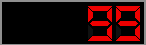
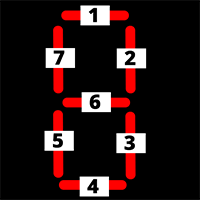
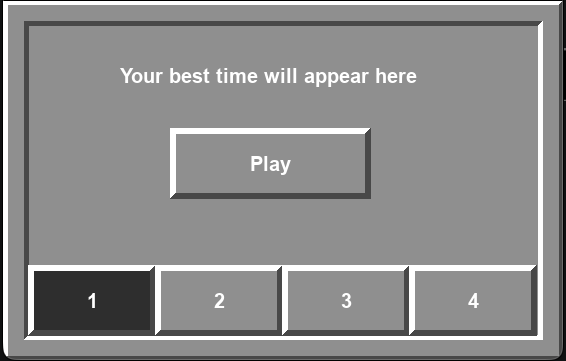

# Programátorská dokumentace - Minesweeper

program je napsaný v angličtině, dokumentace v češtině.

## Úvod

Minesweeper hra v Pythonu.

Je potřeba mít nainstalovaný `Python 3.13` a starší. Plus je potřeba doinstalovat modul `PyGame 2.6.1`

Hra je strukturovaná na oddělené segmenty: model, view a controller (tzv. MVC).

```
Model: game_logic.py
View: drawing_logic.py + templates/
Controller: main.py
```

Rychlý přehled souborů:

`main.py` - hlavní smyčka hry <br>
`configuration.py` - globální konstanty (barvy, složitosti, rozměry) <br>
`saving_system.py` - ukládání pokroku uživatele během hry (časy, vybraná složitost)<br> - poznámka: stav aktuální hry je uložen v instanci game třídy MinesweeperGame v souboru main.py<br>
`game_logic.py` - herní pravidla a práce se stavem hry<br>
`drawing_logic.py` - vykresluje UI hry pomocí GUI modulu PyGame<br> - templates/ - další třídy v oddělených souborech charakterizující další komponenty pro GUI<br>

### Spuštění

1. Stáhnout minimálně složku Minesweeper a celý její obsah.

2. Nainstalovat Python. Potřeba `Python 3.13` a starší kvůli chybě s fonty v PyGame 2.6.1. Lze stáhnout zde: [Python](https://www.python.org). Pro další příkazy doporučuji přidat instalaci Pythonu do `environment variables`, aby fungovaly následující příkazy.

3. Nainstalovat `PyGame 2.6.1` a novější lze instalovat do virtuálního prostředí:
   - Otevřete terminál na místě, kde se nachází složka Minesweeper. `cd path-to-Minesweeper/Minesweeper`
   - `python3.13 -m venv path/to/venv`. Vytvoří nové virtuální prostředí.
   - `source path/to/venv/bin/activate`
   - `python3.13 -m pip install pygame`. Nainstaluje modul PyGame.
   - `python3.13 -m main` Spustí hlavní python soubor, která spustí main loop hry.

4. Bez terminálu:
   - Otevřít v editoru kódu a spustit.

> Poznámka: Testováno na MacOS 26.2 s instalací homebrew. Python 3.13 a PyGame 2.6.1. Nezaručena funkčnost na všech zařízeních.

Pro detailnější specifikace pravidel hry Minesweeper a spuštění a používání najdete zde: [uživatelská dokumentace](user.md)

## Hlavní část programu -> main.py

Hlavní smyčka programu se nachází v souboru: `Minesweeper/main.py`. Spouští se funkcí `def main()`

Ve stejném souboru `main.py` se rozlišují stavy, ve kterém se hra nachází, jsou dva: `state_game` a `state_menu`. Pomocí nich se identifikuje, co se má zobrazit v GUI.

Eventy od uživatele se registrují ve stejné smyčce pomocí `pygame.event.get()`

```
for event in pygame.event.get():
    if event.type == pygame.QUIT: running = False
    if event.type == pygame.MOUSEBUTTONDOWN:
        ... další kód event.button == 1 -> levé tlačítko, event.button == 3 -> pravé tlačítko atd.
```

## Konfigurace -> configuration.py

Programátor/Uživatel může konfigurovat velikost pole, barvy, název hry a další věci v souboru: `configuration.py`

## Herní logika -> game_logic.py

Tento soubor spravuje pole a herní logiku, jak se má hra chovat. Je rozdělen na dvě třídy:

1. `GameSquare` - jednotka v poli

```
class GameSquare:
    """GameSquare and its variables"""
    def __init__(self):
        self.mine = False
        self.flag = False
        self.number = 0
        self.revealed = False
```

2. `MinesweeperGame` - definuje pole a funkce, které upravují pole podle registrace příkazů od uživatele nebo kontrolují jeho stav

```
class MinesweeperGame:
    def __init__(self):
        self.board = []
        self.start_time = 0
        self.end_of_game = False
        self.has_won = False
        self.is_running = False
        self.start_pos = None

    ... další funkce
```

> Poznámka: Samotné pole je vytvořeno jako 2D Array, kde každý element je instance game_square třídy `GameSquare`

Například tato část kódu zkontroluje výhru uživatele pokud už odkryl všechna políčka bez miny:

```
def check_has_won(self):
    """
    After every revealed game square, this function checks whether the user has won.
    """
    revealed_without_mine = 0

    for row in range(config.NUMBER_OF_ROWS):
        for column in range(config.NUMBER_OF_COLUMNS):
            if(not self.board[row][column].mine and self.board[row][column].revealed):
                revealed_without_mine += 1

    game_squares_total = config.NUMBER_OF_COLUMNS * config.NUMBER_OF_ROWS

    if(revealed_without_mine == (game_squares_total - config.NUMBER_OF_MINES)):
        self.has_won = True
        self.end_of_game = True
        save_sys.save_successful_game((pygame.time.get_ticks() - self.start_time)//1000)
```

Tato část se nezabýva vykreslováním, ale pouze jen logikou hry. Soubor, co se zabývá vykreslováním je
`drawing_logic.py` a pomocné soubory ve složce `templates`

V tomto souboru je použito několik algoritmů. Například zde je použito DFS na prohledávání do hloubky pomocí implementace zásobníku:

```
def reveal_blank_game_squares(self, row, column):
    """
    It reveals blank game squares after the user clicks on a game square to reveal.
    """
    directions = ((0,1),(1,1),(1,0),(1,-1),(0,-1),(-1,-1),(-1,0),(-1,1))

    # a queue with only one element, the starting one to reveal the other ones
    stack = [[self.board[row][column], row, column]]

    while stack != []:
        game_square = stack.pop()

        for direction in directions:
            new_row = game_square[1] + direction[1]
            new_column = game_square[2] + direction[0]
            if(new_row >= 0 and new_column >= 0 and new_row < config.NUMBER_OF_ROWS and new_column < config.NUMBER_OF_COLUMNS):
                if(self.board[new_row][new_column].revealed == False and self.board[game_square[1]][game_square[2]].number == 0):
                    self.board[new_row][new_column].revealed = True
                    stack.append([self.board[new_row][new_column], new_row, new_column])
```

## Vykreslovací logika -> drawing_logic.py

Soubor `drawing_logic.py` se zabývá vykreslováním pole, menu a dalších prvků pomocí modulu `PyGame`. K tomu mu slouží pomocné třídy

Je organizován do jediné třídy: `Interface`:

```
class Interface:
    def __init__(self):
        return
```

nemusí si ukládat žádné proměnné, protože jenom dostane data přes parametry ve funkcích a ty vykreslí.

Tato část kódu vykresluje UI menu vlevo během hry:

```
def draw_the_ui_panel(self, time, mines_left_in_the_board, screen):
    """
    It draws the UI panel on the left
    """

    this_frame = frame.UI_Frame(config.BOARD_WIDTH, 0, config.UI_WIDTH, config.BOARD_HEIGHT, screen)
    frame_rect = this_frame.get_frame_rect()

    digiNum_height_time = 50
    digiNum.UI_Text(time, frame_rect.x, frame_rect.y, frame_rect.width, digiNum_height_time, screen)

    digiNum_height_mine = 50
    digiNum.UI_Text(mines_left_in_the_board, frame_rect.x, frame_rect.y + digiNum_height_time, frame_rect.width, digiNum_height_mine, screen)

    btn_height_menu = 70
    btn_height_restart = 70

    menu_btn = btn.UI_Button("Menu", frame_rect.x, frame_rect.y + frame_rect.height - btn_height_menu - btn_height_restart, frame_rect.width, btn_height_menu, screen)
    restart_btn = btn.UI_Button("Restart", frame_rect.x, frame_rect.y + frame_rect.height - btn_height_restart, frame_rect.width, btn_height_restart, screen)

    return restart_btn.get_rect(), menu_btn.get_rect()
```

### Pomocné třídy

slouží k rozšíření funkcí souboru `drawing_logic.py` do více tříd

uložené ve složce `Minesweeper/templates/`

#### button.py


předefinovaný vzor tlačítka, vrací `pygame.Rect()` pomocí funkce `button.get_rect()`

používá se například v Menu u tlačítka `Play` nebo v UI side panelu během hry u tlačítek `Restart` a `Menu`

#### digital_number_display.py



soubor na zobrazování čísel digitálně

je tam předefinovaná červená barva textu s černým pozadím podle originální hry minesweeper

obsahuje třídu `UI_Text`, kam se zadá číslo a to se zobrazí podle daných souřadnic a velikosti na určitém místě na obrazovce

funkce `draw_digits()` a `draw_one_digit()` se orientují podle následujícího schématu: <br>



Kde dané 7 bitové číslo je `0b01234567`. MSb je nevyužitý.

Pro zobrazení dané číslice se používá bitová operace `AND` jako maska

#### window_frame.py



na tvorbu rámu danou pomocí `width`, `height`, `x`, `y`

Na tvorbu rámu jsou použity pygame funkce: `pygame.draw.rect` (pro výplň rámu) a `pygame.draw.polygon` (pro stíny)

`get_frame_rect()` vrací velikost rámu a x, y, podle kterého se dá určit umístění obsahu uvnitř.

#### selection_buttons.py


používané v menu na výběr složitosti mezi 1 až 4.

Vždy může být označené maximálně jedno tlačítko.
