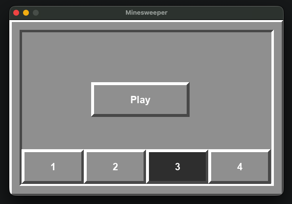
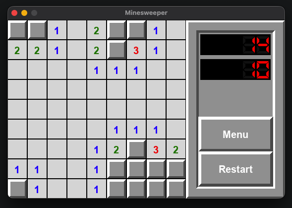

# Uživatelská dokumentace - Minesweeper

## Jak spustit hru?

1. Stáhnout minimálně složku Minesweeper a celý její obsah.

2. Nainstalovat Python. Potřeba `Python 3.13` a starší kvůli chybě s fonty v PyGame 2.6.1. Lze stáhnout zde: [Python](https://www.python.org). Pro další příkazy doporučuji přidat instalaci Pythonu do `environment variables`, aby fungovaly následující příkazy.

3. Nainstalovat `PyGame 2.6.1` a novější lze instalovat do virtuálního prostředí:
   - Otevřete terminál na místě, kde se nachází složka Minesweeper. `cd path-to-Minesweeper/Minesweeper`
   - `python3.13 -m venv path/to/venv`. Vytvoří nové virtuální prostředí.
   - `source path/to/venv/bin/activate`
   - `python3.13 -m pip install pygame`. Nainstaluje modul PyGame.
   - `python3.13 -m main` Spustí hlavní python soubor, která spustí main loop hry.

4. Bez terminálu:
   - Otevřít v editoru kódu a spustit.

Poznámka: Testováno na MacOS 26.2 s instalací homebrew. Python 3.13 a PyGame 2.6.1. Nezaručena funkčnost na všech zařízeních.

## Menu



V menu jsou na výběr 4 složitosti hry. A hra lze spustit tlačítkem `Play`.

1 je nejlehčí a 4 nejtěžší.

Lze je změnit v Minesweeper/configuration.py

Přednastavené:

```
1: 9x9 pole s 10 minami (Beginner)
2: 16x16 pole s 30 minami (Intermediate)
3: 30x16 pole s 99 minami (Hard)
4: 30x30 pole s 225 minami (Expert)
```

Jakmile úspešně dohrajete hru, v menu se zobrazí Váš nejlepší čas.

## Hlavní hra a ovládání



```
Ovládání

Stisknutí levého tlačítka myši právě když se kurzor nachází nad určitým polem -> pole se odkryje
Stisknutí pravého tlačítka myši pravě když se kurzor nachází nad určitým polem:
    - Pokud je pole označené vlaječkou, tak se vlaječka zruší a pole lze odkrýt
    - Pokud je pole neoznačené vlaječkou, tak se vlaječkou označí a pole následně nebude možné omylem odkrýt
```

Levým tlačítkem stisknete tlačítko.

Vrchní časomíra udává počet uběhlých sekund od začátku hry.

Dolní počet naopak udává počet zbývajících min do konce hry.

Tlačítkem `Restart` se restartuje hra se stejnou složitostí.

Tlačítkem `Menu` se vrátíte zpátky do menu. Lze si poté vybrat složitost a hrát znovu. Ovšem současná hra skončí a neuloží se.

#### Výhra

Pokud dohrajete a nenarazíte na minu, tak se Váš čas uloží a zastaví, počet min klesne na nulu a můžete se vrátit do menu. Pokud to byl Váš dosavadní nejlepší čas. Tak se zobrazí nad tlačítkem `Play`

#### Prohra

Pokud dohrajete, ale narazíte na minu, tak se čas zastaví, neuloží a zobrazí se všechny políčka s minou v červeném.
